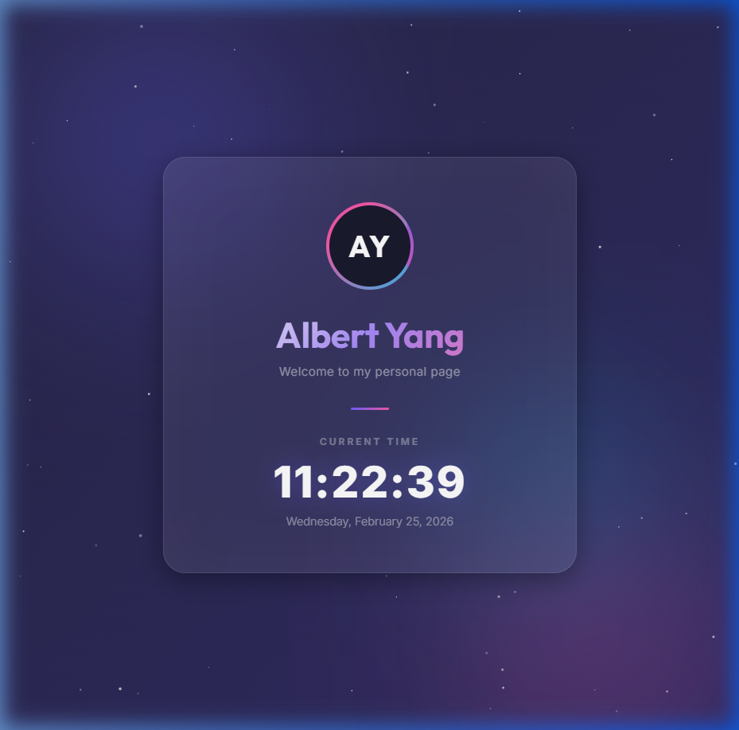

# Class 1 — Session Summary

**Date:** Wednesday, February 25, 2026  
**Author:** Albert Yang (`albertiscool`)

---

## Preview



---

## What We Did Today

### 1. 🎨 Built a Personal Single Page (`index.html`)

Created a modern, visually stunning personal webpage from scratch using **HTML, CSS, and JavaScript**. The page features:

- **Animated gradient background** — A smoothly shifting dark purple/indigo gradient (`gradientShift` animation).
- **Floating glowing orbs** — Three decorative blurred circles in purple, pink, and cyan that drift across the screen.
- **Twinkling star particles** — An HTML `<canvas>` with 80 tiny dots that float and pulse, creating a cosmic night-sky effect.
- **Glassmorphism card** — A frosted-glass card at the center using `backdrop-filter: blur()` with a subtle border and inset glow.
- **Avatar with animated ring** — Initials **AY** displayed inside a circle wrapped in a rotating gradient border.
- **Name in gradient text** — "Albert Yang" rendered with a purple-to-pink gradient fill.
- **Live clock** — A real-time digital clock that updates every second, showing hours, minutes, seconds, and the full date.
- **Google Fonts** — Used `Inter` (for body/clock) and `Outfit` (for headings/avatar) for premium typography.
- **Responsive design** — Uses `clamp()` and `min()` to adapt to any screen size.

**Tech stack:** Pure HTML + CSS + vanilla JavaScript (no frameworks, no dependencies).

---

### 2. 🛠️ Installed Git

Git was not available on the system, so we installed it:

- Used `winget install --id Git.Git` to install **Git v2.53.0** for Windows.
- Refreshed the `PATH` environment variable so Git could be used in the current session.

---

### 3. ⚙️ Configured Git

Set up global Git configuration:

```bash
git config --global user.name "albertiscool"
git config --global user.email "albert920404@gmail.com"
```

---

### 4. 📦 Initialized Repository & Committed

```bash
git init
git add .
git commit -m "Initial commit: personal page for Albert Yang"
```

- Created a new Git repository in `C:\Users\user\Desktop\l1`.
- Staged and committed `index.html` as the first commit.

---

### 5. 🚀 Pushed to GitHub

```bash
git remote add origin https://github.com/albertiscool/class1.git
git branch -M main
git push -u origin main
```

- Connected the local repo to the remote GitHub repository.
- Renamed the default branch to `main`.
- Successfully pushed the code to [**github.com/albertiscool/class1**](https://github.com/albertiscool/class1).

---

## Files in This Project

| File         | Description                                      |
|--------------|--------------------------------------------------|
| `index.html` | Personal single-page website with live clock     |
| `class1.md`  | This summary document                            |

---

## Key Takeaways

1. A single HTML file can produce a premium-looking webpage with no frameworks.
2. CSS animations (`@keyframes`) and `backdrop-filter` enable modern glassmorphism effects.
3. The `<canvas>` API is great for lightweight particle effects.
4. Git + GitHub provide version control and easy code sharing.

---

*Generated on February 25, 2026*
